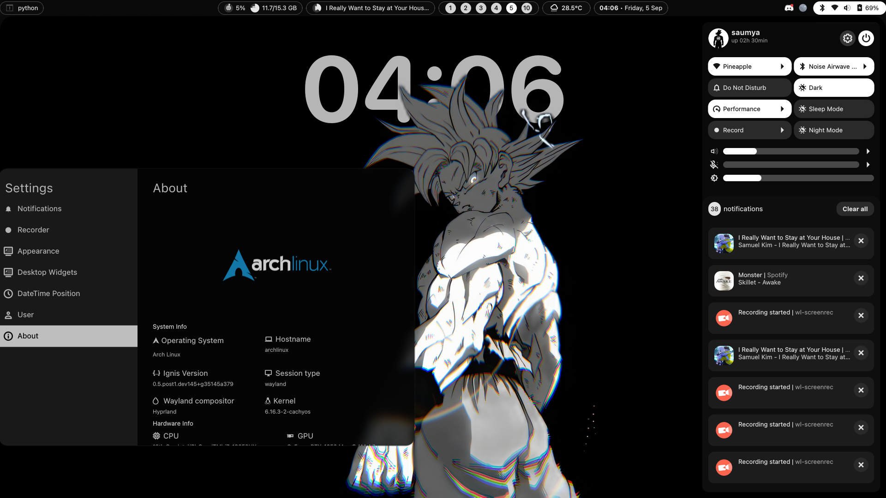
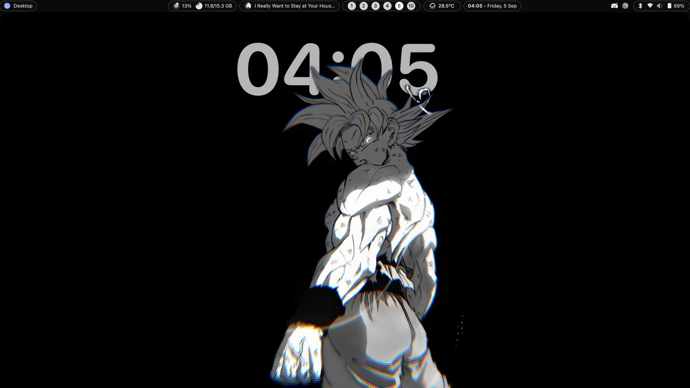

  
  
  <a href="https://github.com/ignis-sh/ignis">
    
  
  </a>
  

<h2> Screenshots</h2>
<table align="center">
  <tr>
    <td colspan="2"></td>
  </tr>
  <tr>
    <td colspan="1"></td>
    <td colspan="1"></td>
  </tr>
</table>

# TODO

- [x] Bar Skeleton
- [x] System Usage Info in Bar
- [x] Weather Info in Bar
- [x] Control Center
- [x] Notifications
- [x] Notification Center
- [x] Screenshot Notification Layout
- [x] Bluetooth Module
- [x] Player Expanded
- [x] Calendar Widget in Bar
- [x] More Info in Settings
- [x] Volume and Brighness OSD
- [ ] AI Panel
- [x] System Tray
- [x] Workspaces Indicator
- [x] Power Profiles Support
- [x] Idle Inhibition
- [x] Recording Indicator
- [x] Desktop Widgets
- [x] Depth Wallpapers
- [x] Matugen Support (complete)
- [ ] OTP Manager
- [x] Multi-monitor Support
- [ ] Extensive Configuration Support
- [ ] Installer

# Credits

- [Linkfrg](https://github.com/linkfrg/) for creation of [ignis](https://github.com/ignis-sh/ignis) without it this shell would'nt exists and his awesome [dotfiles](https://github.com/linkfrg/dotfiles)
- [Tanish](https://github.com/randomboi404) for usefull snippets and ideas - [Veloria](https://github.com/randomboi404/veloria)

_ignis means fire while flux means flow so basically its "flow of fire"_

_A computer is like air conditioning - it becomes useless when you open Windows_  
~ [_Linus Torvalds_](https://www.youtube.com/watch?v=mjqTDtEY8W)
